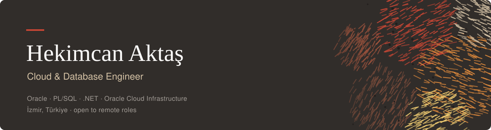

<div align="center">
  
</div>

<div align="center">
  
</div>

Software Engineering undergraduate focused on designing and building reliable, maintainable, scalable, and secure software systems.

Academic focus areas: software design, algorithms, data structures, database systems, object-oriented programming, web technologies, operating systems, computer networks, software architecture, software requirements analysis, software quality, software security, secure software development, application security principles, enterprise software development, relational database engineering, distributed systems, and full-stack application architecture.

<br/>

&nbsp;&nbsp;I'm a Software Engineer at **Probel Yazılım**, building enterprise software with the Microsoft ecosystem while independently developing AI/ML systems and intelligent applications.
&nbsp;&nbsp;My work spans the full software lifecycle—from designing relational database models and backend architectures with **C#, ASP.NET MVC, ASP.NET Core, Oracle, and PL/SQL**, to building modern web interfaces and AI-powered applications.
&nbsp;&nbsp;I enjoy engineering software that is **reliable, maintainable, scalable, secure, and production-ready**.

<br/>

### Currently

```text
role      Software Engineer · Probel Yazılım
focus     Enterprise Full Stack Development · .NET · Oracle · AI Systems
project   GIDEON — voice-controlled desktop AI assistant (graduation project)
based     Turkey
```

### Selected work

◆ Enterprise Software Development (Probel Yazılım)

Developing enterprise-scale business applications using Microsoft's technology stack. Building and maintaining full-stack systems with C#, ASP.NET MVC, ASP.NET Core, Oracle Database and PL/SQL while working with relational database design, backend services, business logic, REST APIs, authentication, performance optimization, and secure software development practices.

C# · ASP.NET MVC · ASP.NET Core · Oracle · PL/SQL · SQL · Entity Framework · REST APIs

<br/>

◆ GIDEON — graduation project

A wake-word desktop AI assistant for Windows behind a holographic, cinematic interface.
It transcribes speech locally with faster-whisper, routes real coding & research tasks to a
GLM agent (Z.AI API), executes system and web actions, and replies out loud with edge-tts.
A Python backend and an Electron UI talk over a local WebSocket:
wake word → STT → intent router → system / agents → TTS.
Trivial commands stay on a fast local router; only real work hits the agent — which edits files,
runs PowerShell, researches the web and verifies outcomes behind a safety gate for destructive
actions. Auto language mirroring (TR/EN) and graceful offline behavior included.

Python · Electron · faster-whisper · openWakeWord · GLM / Z.AI · edge-tts · WebSockets

<br/>

RAG Chatbot Platform — retrieval-augmented assistant with LangChain + vector search, Turkish NLP pipeline, production Next.js front-end.

Restaurant POS — end-to-end point-of-sale shipped to a paying client (real-time orders, inventory, dashboards).

Deep Learning from scratch — backpropagation by hand in NumPy, then CNNs on CIFAR-10. The math before the framework.

<div align="left">
<a href="https://github.com/hekimm?tab=repositories">

</a>
</div>

<br/>

### Stack

```text
enterprise C# · .NET · ASP.NET MVC · ASP.NET Core · Entity Framework · Oracle · PL/SQL · SQL Server · REST APIs
backend    FastAPI · Node.js · PostgreSQL · Redis · WebSockets
frontend   React · Next.js · TypeScript · Electron · Tailwind CSS
ai/ml      PyTorch · TensorFlow · scikit-learn · NumPy · Pandas
llm        LangChain · Ollama · RAG · faster-whisper · LoRA / QLoRA
infra      Docker · Git · Linux · AWS · Vercel
languages  C# · Python · TypeScript · Java · C · C++
```
